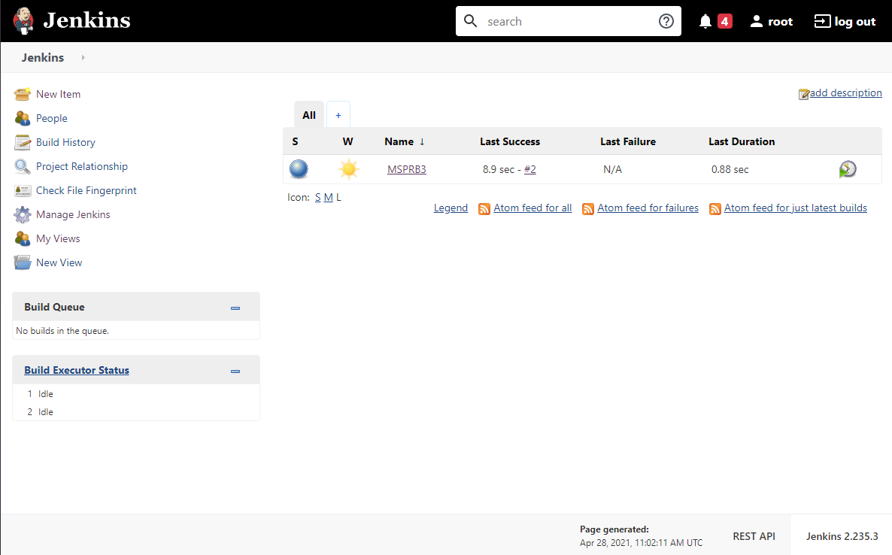
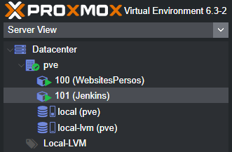
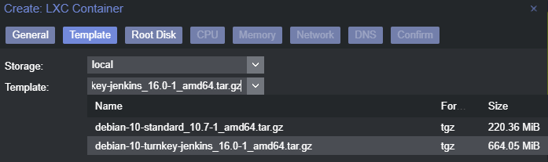

# MSPRB3Dev
This is the MSPR project of the third year at EPSI Nantes. Project Duration : 20h.

The Java Program : </br>
  &nbsp;&nbsp;&nbsp;&nbsp;1 - Read text file; </br>
  &nbsp;&nbsp;&nbsp;&nbsp;2 - Generate HTML from infos in text files; </br>
  &nbsp;&nbsp;&nbsp;&nbsp;3 - Check if export files/folders exist and create them if not; </br>
  &nbsp;&nbsp;&nbsp;&nbsp;4 - Write into files the generated HTML code; </br>
  &nbsp;&nbsp;&nbsp;&nbsp;5 - Generate HTML file on multi threads; </br>


## How to Start
```
git clone https://github.com/Kev1venteur/MSPRB3Dev.git
```

## Java info
:pencil2: Built with [Adopt OpenJDK 11](https://adoptopenjdk.net/). </br></br>
:pencil2: To run it, you have to download [Java](https://www.java.com/en/download/manual.jsp). </br></br>
:pencil2: You can build it with [maven](https://maven.apache.org/download.cgi). </br>

## CI/CD
:pencil2: Continuous Integration/Delivery with [Jenkins](https://www.jenkins.io/) </br></br>


## How to build
:pushpin: From a command prompt :
``` sh
$ git clone https://github.com/Kev1venteur/MSPRB3Dev.git
$ cd MSPRB3Dev
$ mvn clean package
$ mv target/msprb3-1.0.jar ./msprb3-1.0.jar
$ java -jar msprb3-1.0.jar
```

## Environnement Setup
:pushpin: Here we installed Jenkins from LXC Container on proxmox : </br></br>
 </br>


## How to contribute
Just send a pull-request :trophy:

## Authors
:cocktail: <b>Kilian Le Roux</b> - <i>Developper | Sysadmin</i>. </br>
:cocktail: <b>Etienne Drapp</b> - <i>Developper | Sysadmin</i>. </br>
:cocktail: <b>Maël Coubrun</b> - <i>Developper | Sysadmin</i>. </br>
:cocktail: <b>Kévin Gillet</b> - <i>Developper | Sysadmin</i> - <a href="https://www.linkedin.com/in/k%C3%A9vin-gillet-50b25b175/">Linkedin</a>.

## Sources
:gem: Jenkins Install : https://www.jenkins.io/doc/book/installing/ </br>
:gem: Maven Install : https://maven.apache.org/install.html </br>
:gem: How to work with jar files : https://stackoverflow.com/questions/394616/running-jar-file-on-windows </br>
